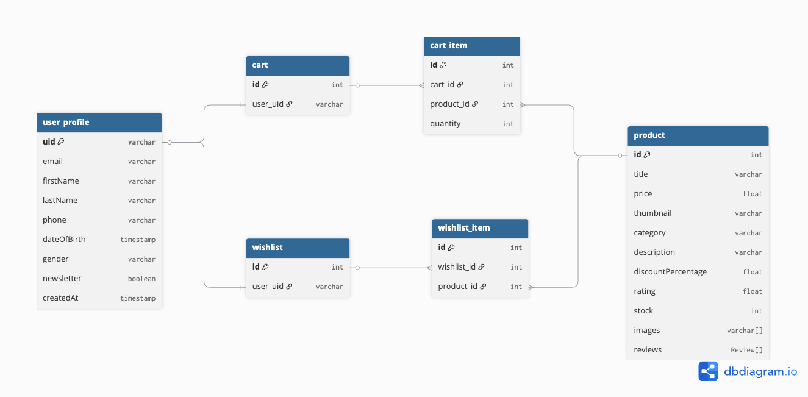

# Ecommerce Angular App

URL de la app: https://ecommerce-prueba-bambu.web.app/

---

## 📋 Tabla de Contenidos

1. [Requisitos previos](#1-requisitos-previos)
2. [Instalación y configuración](#2-instalación-y-configuración)
   - [Clonar el repositorio](#21-clonar-el-repositorio)
   - [Instalar dependencias](#22-instalar-dependencias)
   - [Configurar variables de entorno](#23-configurar-variables-de-entorno)
   - [Configurar Firebase](#24-configurar-firebase)
3. [Ejecutar la aplicación](#3-ejecutar-la-aplicación)
4. [Reglas de seguridad de Firestore](#4-reglas-de-seguridad-de-firestore)
5. [Deploy a Firebase Hosting](#5-deploy-a-firebase-hosting)
6. [Decisiones técnicas](#6-decisiones-técnicas)
7. [Diagrama Entidad-Relación (ER)](#7-diagrama-entidad-relación-er)


---

## 1. Requisitos previos

- Node.js y npm instalados.
- Cuenta en [Firebase](https://console.firebase.google.com/).
- (Opcional) Angular CLI instalado globalmente:  
  ```bash
  npm install -g @angular/cli
  ```

---

## 2. Instalación y configuración

### 2.1 Clonar el repositorio

```bash
git clone <URL-del-repo>
cd ecommerce-app
```

---

### 2.2 Instalar dependencias

```bash
npm install
```

---

### 2.3 Configurar variables de entorno

1. Copia el archivo de ejemplo:
   ```bash
   cp environments/enviroments.example.ts environments/enviroments.ts
   ```
2. Abre `environments/enviroments.ts` y reemplaza los valores de ejemplo por los de tu proyecto de Firebase y la URL de la API:
   ```ts
   export const environment = {
     production: false,
     firebaseConfig: {
       apiKey: "<TU_API_KEY>",
       authDomain: "<TU_PROJECT_ID>.firebaseapp.com",
       projectId: "<TU_PROJECT_ID>",
       storageBucket: "<TU_PROJECT_ID>.appspot.com",
       messagingSenderId: "<TU_MESSAGING_SENDER_ID>",
       appId: "<TU_APP_ID>"
     },
     apiUrl: "https://dummyjson.com" // URL base para la API de productos y datos de prueba
   };
   ```
   > **Nota:** En este caso, la variable `apiUrl` debe ser exactamente:  
   > `https://dummyjson.com`  
   > Más información sobre esta API en [DummyJSON](https://dummyjson.com).

3. El archivo `.gitignore` ya está configurado para ignorar los archivos reales de entorno y solo versionar el de ejemplo:
   ```
   environments/*.ts
   !environments/enviroments.example.ts
   ```

---

### 2.4 Configurar Firebase

1. Crea un proyecto en [Firebase Console](https://console.firebase.google.com/).
2. Activa **Firestore Database** y **Authentication (Email/Password)**.
3. (Opcional) Configura Firebase Hosting revisando el archivo `firebase.json`.

---

## 3. Ejecutar la aplicación

```bash
npm start
# o
ng serve
```
- Abre [http://localhost:4200](http://localhost:4200) en tu navegador.

---

## 4. Reglas de seguridad de Firestore

El proyecto usa [AngularFire](https://github.com/angular/angularfire) para conectar Angular con Firebase (Auth y Firestore).  
El carrito y la wishlist de cada usuario se guardan en subcolecciones bajo su usuario en Firestore (`users/{uid}/cart` y `users/{uid}/wishlist`).  
El perfil del usuario se guarda en `/users/{uid}`.

**Reglas recomendadas de Firestore:**
```plaintext
rules_version = '2';
service cloud.firestore {
  match /databases/{database}/documents {
    match /users/{userId} {
      allow read, write: if request.auth != null && request.auth.uid == userId;
    }
    match /users/{userId}/cart/{cartItemId} {
      allow read, write: if request.auth != null && request.auth.uid == userId;
    }
    match /users/{userId}/wishlist/{wishlistItemId} {
      allow read, write: if request.auth != null && request.auth.uid == userId;
    }
  }
}
```

---

## 5. Deploy a Firebase Hosting

Sigue estos pasos para desplegar la aplicación en Firebase Hosting:

### 5.1 Instala Firebase CLI (si no la tienes)

```bash
npm install -g firebase-tools
```

---

### 5.2 Inicia sesión en Firebase

```bash
firebase login
```

---

### 5.3 Inicializa Firebase Hosting (solo la primera vez)

```bash
firebase init
```
- Selecciona **Hosting** y sigue los pasos.
- Elige el proyecto de Firebase correspondiente.
- Como carpeta pública, selecciona `dist/ecommerce-app/browser` (o la carpeta de build que corresponda).
- Configura como aplicación de una sola página (SPA): responde "Sí" a la pregunta sobre `index.html`.

---

### 5.4 Genera el build de producción de Angular

```bash
ng build --configuration=production
```
Esto generará los archivos en la carpeta `dist/ecommerce-app`.

---

### 5.5 Haz deploy a Firebase Hosting

```bash
firebase deploy
```
¡Listo! Tu aplicación estará disponible en la URL de Firebase Hosting que te indique la consola.

---

## 6. Decisiones técnicas

### 6.1 Patrón de estado

- **Signals de Angular:**  
  Se utiliza el sistema de signals de Angular para la gestión reactiva del estado global de la aplicación.  
  Cada servicio singleton (por ejemplo, productos, carrito, usuario, wishlist) expone signals que los componentes pueden consumir directamente.
  ```ts
  @Injectable({ providedIn: 'root' })
  export class CartService {
    cartItems = signal<CartItem[]>([]);
    // ...
  }
  ```
- **Ventajas de signals:**  
  - Reactividad nativa y simple, con bajo boilerplate.
  - Los componentes se actualizan automáticamente cuando cambia el estado.

### 6.2 Estructura y modularidad

- **Modularización por dominio:**  
  El código está organizado en módulos y carpetas por dominio funcional:
  - `core/`: Servicios globales (autenticación, productos, carrito, wishlist, guards, interceptores).
  - `auth/`: Páginas de autenticación (login, registro, perfil).
  - `shop/`: Funcionalidad principal de la tienda (home, productos, detalle, carrito, wishlist, componentes de UI).
  - `shared/`: Componentes reutilizables (navbar, footer, modal login, etc).
  - `not-found/`: Página 404.
- **Ruteo avanzado:**  
  - El archivo `app.routes.ts` define las rutas principales y carga el módulo de la tienda (`shop.routes.ts`) de forma lazy, optimizando el performance inicial.
  - Rutas protegidas con `AuthGuard` para páginas que requieren autenticación, asegurando la seguridad y privacidad de los datos del usuario.

### 6.3 UI y experiencia de usuario

- **PrimeNG + Tailwind CSS:**  
  - Se utilizan componentes de [PrimeNG](https://primeng.org/) para una interfaz rica, accesible y profesional.
  - [Tailwind CSS](https://tailwindcss.com/) se usa para utilidades de diseño responsivo y personalización rápida de estilos.
- **Componentes Standalone:**  
  - El proyecto aprovecha los Angular Standalone Components, lo que simplifica la estructura, reduce dependencias y mejora el rendimiento.

### 6.4 Integración con Firebase

- **AngularFire:**  
  - Se utiliza AngularFire para la integración con Firebase Auth y Firestore.
  - El perfil del usuario, carrito y wishlist se almacenan en Firestore bajo la colección `users/{uid}` y sus subcolecciones.
  - El acceso a los datos está protegido por reglas de seguridad que garantizan que cada usuario solo pueda leer y escribir sus propios datos.
- **Desnormalización:**  
  - Los ítems de carrito y wishlist guardan una copia de los datos relevantes del producto para evitar lecturas adicionales y simplificar la UI.

---

## 7. Diagrama Entidad-Relación (ER)

